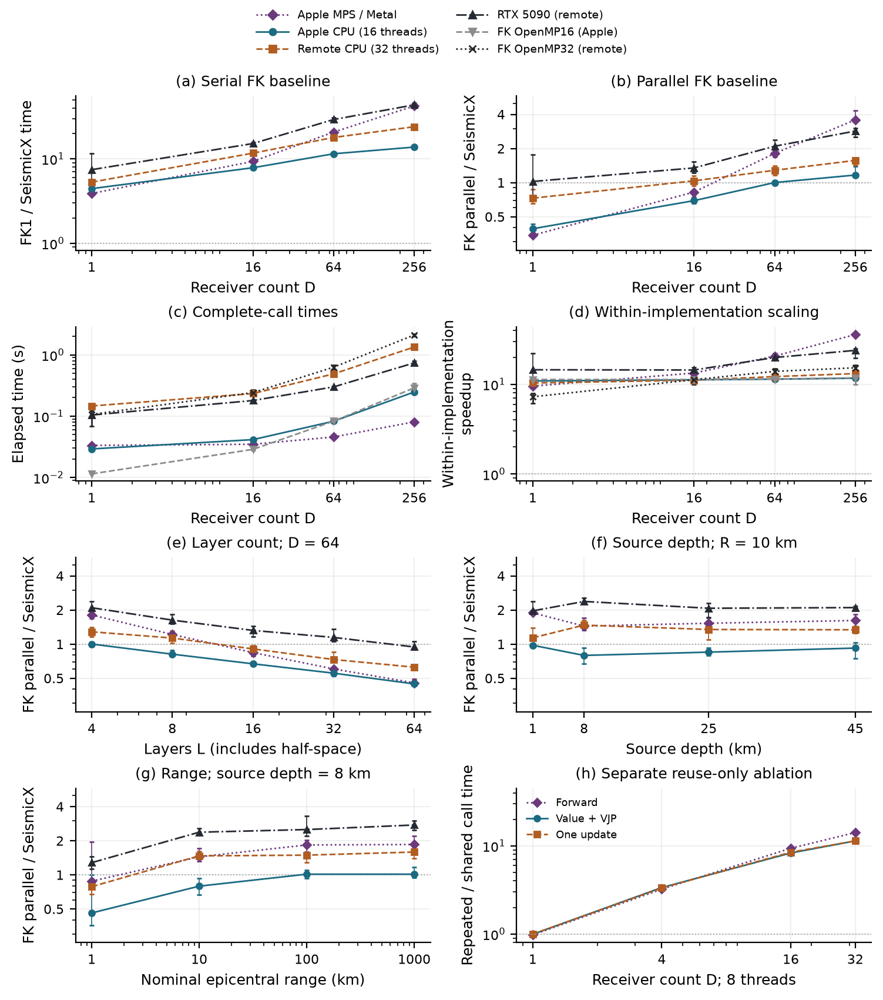

# SeismicX GRTM Community

English | [简体中文](README.zh-CN.md)

**User documentation, binary downloads, and benchmark results for SeismicX GRTM.**
Compute layered-medium Green's functions with C/CPU, NVIDIA CUDA, or Apple Metal,
using one Python interface. This repository provides usage examples and numerical
data; solver implementation source and development history are not distributed here.

[PyPI](https://pypi.org/project/seismicx-grtm/) ·
[Binary downloads](downloads/README.md) · [Quick start](docs/QUICKSTART.md) ·
[FK comparison](benchmarks/fk/README.md) ·
[Report a problem](https://github.com/cangyeone/seismicx-grtm-community/issues)

## Installation

```sh
python -m pip install seismicx-grtm
# Optional receiver-function inversion and framework adapters:
python -m pip install 'seismicx-grtm[rf]'
python -m pip install 'seismicx-grtm[torch,jax]'
```

The current stable release is **0.5.1**, for CPython **3.10–3.14**. Import with
`import grtm`; the command-line program is `grtm`.

| System | Included engines | Requirements |
|---|---|---|
| Apple Silicon Mac | CPU + Metal/MPS | macOS 11+; Apple M4 Max tested |
| Linux / WSL x86_64 | CPU + CUDA | glibc 2.28+; CPU needs no GPU |
| CUDA execution | CUDA 12.8, compute capability 12.0 | Compatible NVIDIA driver; RTX 5090 tested |

No compiler or CUDA toolkit is needed to install a wheel. Native Windows, Intel
Mac, Linux ARM, and older NVIDIA GPU architectures have no matching GPU binary
in this release. See [installation and troubleshooting](docs/INSTALLATION.md).

## Research preview: 0.6.0.dev1

The [binary prerelease](https://github.com/cangyeone/seismicx-grtm-community/releases/tag/v0.6.0.dev1)
adds directional structural JVPs, node-local reverse VJPs, a JAX matrix-free
reverse option and independent Gauss/Levin/guarded-Shanks quadrature.
Read the [preview guide](docs/RESEARCH_PREVIEW.md) · [中文](docs/RESEARCH_PREVIEW.zh-CN.md)
for installation, examples and guarantee limits. The stable PyPI version remains
**0.5.1**; download and install a matching preview wheel explicitly.

Structural derivatives and research quadrature execute on CPU. Fixed-grid
operator derivatives and adaptive quadrature are separate APIs; adaptive
quadrature has no framework backward adapter and does not certify a full
native integral. The existing FK benchmark remains the older frozen experiment.

## First calculation

```python
import grtm

model = grtm.example_model(units="si")
model.update(log2_samples=6, dt=0.2, distances=[10000., 30000.], t0=[0., 0.])
solver = grtm.Solver(backend="cpu")  # also: "cuda", "metal", "mps"
result = solver.forward(
    model, sdr=(20, 40, 60), scalar_moment=1e15, azimuth=45,
    fields=("displacement", "strain", "stress"), threads=4,
)
print(result["displacement"].shape)  # (2, 64, 3)
print(result["field_units"])
```

High-level calculations default to **NED coordinates and SI units**. Without a
source-time history, the results are impulse kernels: displacement m/s, strain
1/s, stress Pa/s. Supply a dimensionless source history to obtain displacement
in m and stress in Pa. The short example demonstrates the interface; select a
sufficient record length and check integration convergence for scientific use.

## User guide

| Task | Guide |
|---|---|
| Install with pip, download wheels, choose CPU/GPU | [Installation](docs/INSTALLATION.md) · [中文](docs/INSTALLATION.zh-CN.md) |
| Build a model, run the CLI, save and read results | [Quick start](docs/QUICKSTART.md) |
| Moment tensor / strike–dip–rake, units, displacement, strain and stress | [Forward API](docs/PYTHON_FORWARD.md) · [中文](docs/PYTHON_FORWARD.zh-CN.md) |
| Large Earth-model batches, Jacobians and VJPs, PyTorch and JAX | [Forward API](docs/PYTHON_FORWARD.md#large-earth-model-batches) |
| Apple GPU and PyTorch MPS selection | [Apple Metal](docs/APPLE_METAL.md) · [中文](docs/APPLE_METAL.zh-CN.md) |
| H–κ initialization → RF waveform fitting → structural inversion | [Receiver functions](docs/RECEIVER_FUNCTIONS.md) · [中文](docs/RECEIVER_FUNCTIONS.zh-CN.md) |
| Input/output and solver options at a glance | [API reference](docs/API_REFERENCE.md) |
| Directional JVP, adjoint VJP, JAX reverse and new quadrature (0.6 preview) | [Preview API guide](docs/RESEARCH_PREVIEW.md) · [中文](docs/RESEARCH_PREVIEW.zh-CN.md) |
| Precision, attenuation conventions, gradient limits | [Numerical notes](docs/NUMERICAL_NOTES.md) · [中文](docs/NUMERICAL_NOTES.zh-CN.md) |
| Installation errors, unexpected amplitudes, memory and speed | [Troubleshooting](docs/TROUBLESHOOTING.md) |

Point-source structural tangents run on the CPU even when CUDA/Metal performs
the forward solve. JAX defaults to dense-Jacobian callbacks; the 0.6 preview
also offers matrix-free reverse mode. PyTorch uses a VJP, with native adjoint
selection added in the preview. The separate elastic receiver-function solver runs in NumPy
on CPU and uses finite differences for structural inversion.

## Performance against FK

The [FK benchmark report](benchmarks/fk/README.md) includes serial FK, our study's
OpenMP FK adaptation, Apple CPU/Metal and remote CPU/RTX 5090 timings. It covers
receiver count, layer count, source depth and epicentral range, and provides all
750 timed calls and 300 warmups as CSV data. Shared remote load and cases where
parallel FK is faster are retained.



The benchmark uses the frozen **0.5.0 scientific snapshot**, not a new timing
campaign for the 0.5.1 PyPI wheels. FK OpenMP is a separately adapted comparator,
not an upstream FK threading feature. Ratios use same-host baselines; they do
not isolate a universal algorithmic speedup. Details and all medians are in the
[report](benchmarks/fk/README.md) and [timing table](benchmarks/fk/TIMINGS.md).

## Downloads and verification

The [v0.5.1 release](https://github.com/cangyeone/seismicx-grtm-community/releases/tag/v0.5.1)
contains the ten wheel assets published on PyPI. Check them against
[SHA256SUMS](downloads/SHA256SUMS). The automatic GitHub “Source code” archives
contain only this documentation/data repository, not the solver implementation.

The release passed installed-package checks across all ten wheels and applicable
real-device tests on Apple M4 Max and RTX 5090. See
[release verification](verification/README.md). Tests of specified models do not
establish accuracy or performance for every Earth model.

The [0.6.0.dev1 preview assets](https://github.com/cangyeone/seismicx-grtm-community/releases/tag/v0.6.0.dev1)
have separate [checksums](downloads/SHA256SUMS-0.6.0.dev1) and
[preview verification](verification/preview-0.6.0.dev1.md). They contain compiled
solver modules and an explicit list of user guides. Solver implementation,
manuscript sources and unpublished experiment archives are excluded.

## Developers

- **Weiping Wang**
- **Xin Liu:** [xinliu_geo@outlook.com](mailto:xinliu_geo@outlook.com)
- **Yuqi Cai:** [caiyuqiming@foxmail.com](mailto:caiyuqiming@foxmail.com)
- **Ziye Yu:** [yuziye@hotmail.com](mailto:yuziye@hotmail.com)

For usage questions and reproducible bug reports, use
[GitHub Issues](https://github.com/cangyeone/seismicx-grtm-community/issues).
Please include package version, OS, Python, backend and a minimal model.

## License and attribution

The binaries and accompanying documentation are distributed under the
[SeismicX GRTM Research and Noncommercial License](LICENSE): noncommercial
scientific research only; commercial use requires separate written permission.
Public access to this repository does not make the solver open source.
Third-party rights are preserved in [NOTICE.md](NOTICE.md) and [licenses](licenses/).

Benchmark references include [Lupei Zhu's FK](https://github.com/rwalkerlewis/fk)
and historical comparisons with [Yunyi Qian's Fortran GRTM](https://github.com/YunyiQian/grtm).
Neither reference implementation is included here or claimed as our work.

When reporting results, identify **SeismicX GRTM**, the package version, backend,
model/sampling settings and relevant integration checks. No article DOI is
claimed by this repository.
